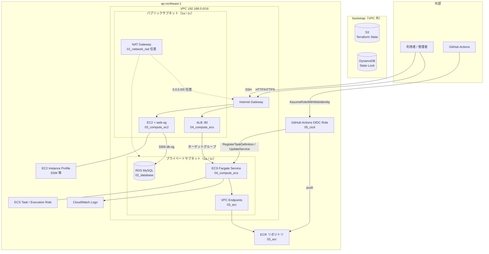
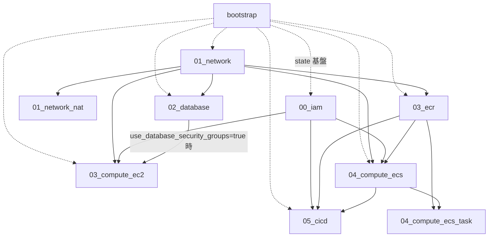

# AWS Terraform

`ap-northeast-1` 向けの Terraform 構成。`bootstrap/` でリモートステート基盤を作成し、`environments/prd/` を番号付きスタックに分割して管理する。

（元 `portfolio` リポジトリの `terraform/aws/` を、履歴を保った状態で分離しました。Go アプリケーションは [`golang`](https://github.com/r-fukuda-git/r-fukuda-golang) に分離済みです。）

## ディレクトリ構成

| パス | 内容 |
|------|------|
| `bootstrap/` | リモートステート用 S3 バケット・DynamoDB ロックテーブル（初回のみ） |
| `modules/` | 再利用モジュール（VPC、SG、EC2、ECS、RDS、IAM、CI/CD など） |
| `environments/prd/` | 本番想定スタック（スタックごとに独立した state） |
| `environments/stg/` | 検証用スタック（prd と同じ番号付き独立スタック構成。state key は `stg/<stack>/...`） |
| `environments/_archive_stg_singleroot/` | 旧・単一 root 版 stg（`.gitignore` 済み。復元用に保持のみ） |

## 検証環境 (stg)

`environments/stg/` は **prd と同じ番号付き独立スタック構成**。各スタックが独立した state（key は
`stg/<stack>/terraform.tfstate`）を持ち、スタック間は `data.terraform_remote_state` で配線する。
prd 側も同じパターンに揃えてある（スタック集合・ファイル構成・SG のインライン管理が一致）。
共有 `modules/` は後方互換の追加のみ:
`modules/rds` の engine 変数化（default が現行 prd 値なので prd の plan は no-op）、
`modules/github_actions_oidc` の `create_oidc_provider` フラグ（default true で従来どおり）。

- **どのコンポーネントを立てるか = どのスタックを apply するか**。組み合わせは apply 順の集合で表現する（下記）。
- **network は建てっぱなし**運用が可能。`01_network` を 1 回 apply したら、compute 系スタックだけを
  日をまたいで apply / destroy して差し替える。`01_network` の state は他スタックから参照されるだけで書き換わらない。
- prd との差分（スタック構成は同一。残る違い）:
  1. データ層（RDS/EFS/ElastiCache）の ingress。**stg は VPC CIDR 許可**（検証用途として十分）、
     **prd は SG 間参照**（クライアント SG からのみ許可、最小権限）。EC2/ALB の ingress は
     stg=`admin_cidr_blocks`、prd=`source_cidr_blocks`。
  2. VPC 帯。stg=`10.20.0.0/16`、prd=`192.168.0.0/16`（非重複）。
  3. `03_ecr` の `create_vpc_endpoints` トグルは stg のみ。prd は VPC エンドポイントを常時作成する。
  4. `05_cicd` は stg が `create_oidc_provider=false`（prd が作成した OIDC プロバイダを data 参照）。

### スタック一覧と依存

| スタック | 立てるもの | 依存（remote_state） |
|----------|-----------|----------------------|
| `00_iam` | EC2 インスタンスプロファイル / ECS タスクロール | なし |
| `01_network` | stg 専用 VPC（`10.20.0.0/16`）/ サブネット / IGW | なし |
| `01_network_nat` | NAT Gateway + private デフォルトルート | `01_network` |
| `02_database` | RDS（engine 自由指定）+ db-sg | `01_network` |
| `03_compute_ec2` | EC2（public）+ web-sg | `01_network`, `00_iam` |
| `03_ecr` | ECR リポジトリ + VPC エンドポイント（`create_vpc_endpoints=false` で無効化可） | `01_network` |
| `04_compute_ecs` | ECS Fargate 常駐 Service + ALB + ecs/alb-sg | `01_network`, `00_iam`, （`ecs_use_ecr=true` 時のみ）`03_ecr` |
| `04_compute_ecs_task` | 単発 / スケジュール ECS Fargate タスク | `01_network`, `00_iam`, `03_ecr`, `04_compute_ecs` |
| `05_cicd` | GitHub Actions OIDC デプロイロール（`create_oidc_provider=false`） | `00_iam`, `03_ecr` |
| `06_efs` | EFS + mount target + efs-sg | `01_network` |
| `07_elasticache` | ElastiCache（redis）+ cache-sg | `01_network` |

private サブネットの Fargate がイメージを取得するには、`01_network_nat` か `03_ecr`（VPC エンドポイント）の
どちらかを併用する。

### RDS の engine 自由指定（`02_database`）

`rds_engine` に `mysql` / `mariadb` / `postgres` を指定。`rds_engine_version` /
`rds_parameter_group_family` / `rds_major_engine_version` /
`rds_enabled_cloudwatch_logs_exports` / `rds_parameters` は未指定なら
engine ごとの既定（`environments/stg/02_database/locals.tf` の `rds_engine_defaults`）から解決する。
db-sg の ingress ポートも engine 既定（MySQL/MariaDB=3306, PostgreSQL=5432）に自動追従する。
PostgreSQL のときオプショングループは作らない（`modules/rds` 側で `count` 制御）。
Aurora（`aws_rds_cluster`）は現状スコープ外。

### 使い方

```bash
# 初回のみ：各スタックで backend.hcl を用意
for s in 00_iam 01_network 01_network_nat 02_database 03_compute_ec2 03_ecr 04_compute_ecs 06_efs 07_elasticache; do
  cd environments/stg/$s
  cp backend.hcl.example backend.hcl
  cd - >/dev/null
done
# terraform.tfvars は prd と同様リポジトリに雛形を置かない。各スタックに手で作成する:
#   env = "stg" / project_name = "<自分>" は必須。他は各スタックの variables.tf の default 参照。
#   03_compute_ec2 は admin_cidr_blocks / ec2_key_path が必須。
make init-all-stg          # stg 全スタックを init

# スタック単位で plan / apply（リポジトリ直下で。ENV=stg を付ける）
make plan  STACK=01_network ENV=stg
make apply STACK=01_network ENV=stg
make destroy STACK=03_compute_ec2 ENV=stg
```

### apply 順（シナリオ別）

`destroy` は逆順。`01_network`（+ 必要なら `00_iam`）は建てっぱなしにして compute 側だけ差し替えてよい。

| シナリオ | apply する順 |
|----------|--------------|
| EC2 のみ | `01_network` → `00_iam` → `03_compute_ec2` |
| RDS のみ（例: postgres） | `01_network` → `02_database` |
| EC2 + RDS | `01_network` → `00_iam` → `03_compute_ec2` → `02_database` |
| ECS（公開イメージ）+ ALB | `01_network` → `00_iam` → `03_ecr`（エンドポイント用）→ `04_compute_ecs` |
| ECS（ECR イメージ）+ RDS | `01_network` → `00_iam` → `03_ecr` → `04_compute_ecs`（`ecs_use_ecr=true`）→ `02_database` |
| 全部入り | `01_network` → `00_iam` → `01_network_nat` → `02_database` → `03_compute_ec2` → `03_ecr` → `04_compute_ecs` → `04_compute_ecs_task` → `05_cicd` → `06_efs` → `07_elasticache` |

各スタックの `terraform.tfvars` と `backend.hcl` は `.gitignore` 済み。`backend.hcl` は `backend.hcl.example` を複製して使う。`terraform.tfvars` は prd と同様、リポジトリに雛形を置かず各自で作成する。

## AWS 構成図（prd）

リージョン `ap-northeast-1`。VPC `192.168.0.0/16` は `01_network`、NAT は任意の `01_network_nat`。



| 配置 | リソース | スタック |
|------|----------|----------|
| パブリック | ALB、EC2（`use_database_security_groups=true` 時は `02_database` の web-sg） | `04_compute_ecs` / `03_compute_ec2` |
| プライベート | RDS、ECS タスク（`assign_public_ip=false`）、VPC Endpoint（ECR API/DKR、Logs、ECS、S3 Gateway） | `02_database` / `04_compute_ecs` / `03_ecr` |
| VPC 外・グローバル | ECR、IAM ロール、GitHub OIDC、Terraform state | `03_ecr` / `00_iam` / `05_cicd` / `bootstrap` |

プライベートサブネットの ECS は `03_ecr` の VPC Endpoint 経由でイメージ取得可能（NAT なし運用向け）。NAT が必要な外向き通信は `01_network_nat` を追加する。

## スタック一覧

| スタック | パス | 主なリソース | 参照する remote state |
|----------|------|--------------|------------------------|
| bootstrap | `bootstrap/` | S3（state）、DynamoDB（lock） | なし |
| 00_iam | `environments/prd/00_iam/` | EC2 用 IAM ロール、ECS タスク実行ロール | なし |
| 01_network | `environments/prd/01_network/` | VPC、サブネット、IGW、ルート（プライベートは NAT なし） | なし |
| 01_network_nat | `environments/prd/01_network_nat/` | NAT Gateway、プライベート RT への 0.0.0.0/0（任意） | `01_network` |
| 02_database | `environments/prd/02_database/` | RDS、web/db 用 SG | `01_network` |
| 03_compute_ec2 | `environments/prd/03_compute_ec2/` | EC2 | `00_iam`, `01_network`, （任意）`02_database` |
| 03_ecr | `environments/prd/03_ecr/` | ECR リポジトリ、ECS 向け VPC Endpoint（Interface + S3 Gateway） | `01_network` |
| 04_compute_ecs | `environments/prd/04_compute_ecs/` | ECS（Fargate ARM64）常駐 Service + ALB、ECS/ALB 用 SG | `00_iam`, `01_network`, `03_ecr` |
| 04_compute_ecs_task | `environments/prd/04_compute_ecs_task/` | 単発 ECS タスク定義（手動 run-task / 任意スケジュール）。ALB なし | `00_iam`, `01_network`, `03_ecr`, `04_compute_ecs` |
| 05_cicd | `environments/prd/05_cicd/` | GitHub Actions OIDC（ECR push / ECS deploy 用 IAM ロール） | `00_iam`, `03_ecr`, `04_compute_ecs`（outputs 参照） |

`modules/eip` は Elastic IP 用モジュールだが、現状どのスタックからも未参照。

## 依存関係



## apply 順

1. **bootstrap**（アカウント初回のみ）
2. **00_iam** と **01_network**（相互依存なし。並列可）
3. **01_network_nat**（プライベートからインターネット egress が必要なときのみ。`01_network` 完了後）
4. **02_database**（`01_network` 完了後）
5. **03_compute_ec2** と **03_ecr**（`01_network` 完了後。EC2 は `00_iam` も必要。EC2 と ECR は相互依存なし。並列可）
   - EC2 で `use_database_security_groups = true` の場合は **02_database** も先に apply すること
6. **04_compute_ecs**（`00_iam` + `01_network` + **03_ecr** 完了後。イメージ tag が ECR に存在すること）
7. **04_compute_ecs_task**（任意。`04_compute_ecs` 完了後。単発タスクのみ必要なとき）
8. **05_cicd**（`04_compute_ecs` と `03_ecr` 完了後。GitHub → ECR → ECS Service の順は従来どおり）

destroy は上記の逆順。

## apply（コピペ用 / Makefile）

前提として、`make init-bootstrap` と `make init-all`（または各スタックの `make init STACK=...`）で init 済みであること。

```bash
make apply STACK=bootstrap
make apply STACK=00_iam
make apply STACK=01_network
make apply STACK=01_network_nat
make apply STACK=02_database
make apply STACK=03_compute_ec2
make apply STACK=03_ecr
make apply STACK=04_compute_ecs
make apply STACK=04_compute_ecs_task
make apply STACK=05_cicd
```

`EXTRA_ARGS` で `terraform apply` に引数を渡せる（例: `EXTRA_ARGS="-auto-approve"`）。

state キー形式: `{terraform_state_key_prefix}/{スタック名}/terraform.tfstate`（例: `prd/01_network/terraform.tfstate`）

## 命名規則

| 対象 | 規則 | 例 |
|------|------|-----|
| Terraform 変数・モジュール引数 | `snake_case` | `container_port`, `host_port` |
| Terraform リソース属性（AWS provider） | provider 定義に従う | `container_port`（`aws_ecs_service.load_balancer`） |
| AWS API / JSON ペイロード | AWS 側のキー名 | `containerPort`, `hostPort`（タスク定義 JSON 内） |

Terraform 変数は `snake_case` に統一する。AWS API が camelCase を要求する箇所（ECS タスク定義 JSON など）のみ、リソースブロック内で AWS 形式を使う。

## モジュール

| モジュール | 用途 |
|------------|------|
| `networking` | VPC、サブネット、IGW、ルート |
| `nat_gateway` | NAT Gateway、プライベート RT へのデフォルトルート |
| `sg` | （未使用）EC2/RDS 用 web・db SG、ECS/ALB 用 SG。prd/stg とも各スタックで SG をインライン管理するようになり参照されていない |
| `iam` | EC2 インスタンスプロファイル、ECS タスク実行ロール |
| `ec2` | EC2 インスタンス |
| `ecs` | ECS クラスター、Fargate サービス、ALB、スタンドアロンタスク |
| `rds` | RDS（engine 可変: mysql / mariadb / postgres。family・ログ種別・オプショングループ有無を変数化） |
| `ecr` | ECR リポジトリ（`03_ecr` スタック） |
| `vpc_endpoints_ecs` | プライベートサブネット向け ECR / Logs / ECS / S3 VPC Endpoint（`03_ecr` スタック） |
| `github_actions_oidc` | GitHub Actions からの OIDC 連携 IAM（`05_cicd` スタック）。`create_oidc_provider`（default true）で OIDC プロバイダの新規作成 / 既存 data 参照を切替 |
| `eip` | Elastic IP（未接続） |
